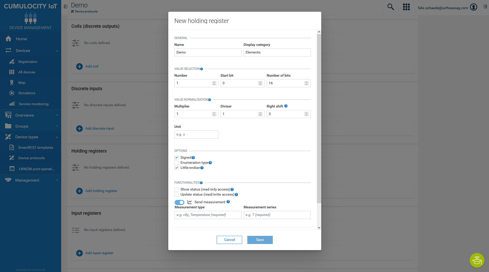
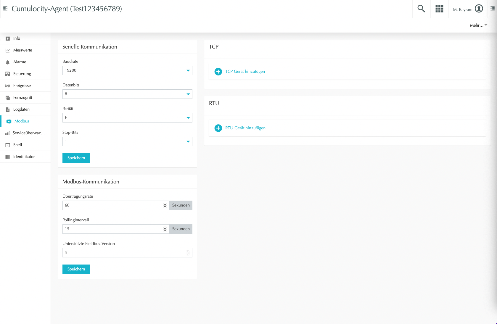

# Cumulocity Modbus Demo
Example implementation of a modbus device in **Cumulocity IoT**. The demo device sends random values via modbus TCP. In the following you will see how to easily connect and read the values from the device with Cumulocity IoT.

Cumulocity is an IoT platform that enables rapid connections of many, many different devices and applications. It allows you to monitor and respond to IoT data in real time and to spin up this capability in minutes. More information on Cumulocity IoT and how to start a free trial can be found [here](https://www.softwareag.cloud/site/product/cumulocity-iot.html#/).

Cumulocity IoT enables companies to quickly and easily implement smart IoT solutions.

The [Cumulocity IoT documentation](https://cumulocity.com/guides/protocol-integration/cloud-fieldbus/) contains detailed instructions on how to connect fieldbus devices to the platform.
______________________


For more information you can Ask a Question in the [TECHcommunity Forums](https://tech.forums.softwareag.com/).
______________________

These tools are provided as-is and without warranty or support. They do not constitute part of the Software AG product suite. Users are free to use, fork and modify them, subject to the license agreement. While Software AG welcomes contributions, we cannot guarantee to include every contribution in the master project.

Contact us at [TECHcommunity](mailto:technologycommunity@softwareag.com?subject=Github/SoftwareAG) if you have any questions.

## Getting started

Simply start via:

```bash
git clone URL
cd cumulocity-modbus-demo
```
In the docker-compose.yml you have to use an identifier such as the serial number or mac address. This serial number will be used for the registration purpose and must be unique across all tenants. Please change it at the beginning.
You can also change the Cumulocity base url if needed.

There will be two containers ramped up:

1. The linux agent that contains the Modbus functionality
2. A Modbus simulator, that simulates random values

Start both containers with:

```bash
docker-compose -up
```

## Device Registration

On Cumulocity side you have to register the device in your tenant. 


## Device Protocol

The Modbus server sends random integer measurements via the holding register from Bit 0 to Bit 16. To read these values with the agent and send them as measurements to Cumulocity, the agent must be remotely configured in Cumulocity.

New fieldbus device protocols can be created in the Device protocols page which is opened from the Device types menu in the navigator. Create a new Modbus device protocol and configure it, as shown below:



Further information on how to read and send events and alarms from Modbus devices can be found in the [Cumulocity IoT documentation](https://cumulocity.com/guides/protocol-integration/cloud-fieldbus/).


## Device Configuration Modbus

Within the device management Application of Cumulocity you will find the tab "Modbus" after the device/agent was registered successfully.



Within here, you can add a TCP Device. The address of the Modbus server is **0**.
For the ip address of the Modbus server use your local ip address. Since the agent is running in a docker container 127.0.0.1 will not work for the docker host. On windows you can display the local network address via the command line with *ipconfig*.
